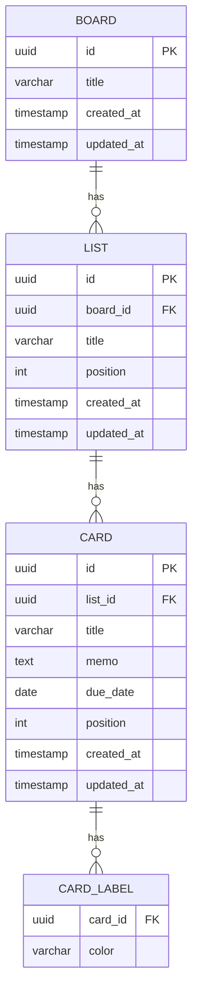

# ER図

## テーブル定義

### BOARD（ボード）
| カラム名 | 型 | 制約 | 説明 |
|---|---|---|---|
| id | UUID | PK | ボードの一意識別子 |
| title | VARCHAR(255) | NOT NULL | ボード名 |
| created_at | TIMESTAMP | NOT NULL | 作成日時 |
| updated_at | TIMESTAMP | NOT NULL | 更新日時 |

### LIST（リスト）
| カラム名 | 型 | 制約 | 説明 |
|---|---|---|---|
| id | UUID | PK | リストの一意識別子 |
| board_id | UUID | FK → BOARD.id | 所属するボード |
| title | VARCHAR(255) | NOT NULL | リスト名（例: TODO / 進行中 / 完了） |
| position | INT | NOT NULL | 表示順（小さいほど左） |
| created_at | TIMESTAMP | NOT NULL | 作成日時 |
| updated_at | TIMESTAMP | NOT NULL | 更新日時 |

### CARD（カード）
| カラム名 | 型 | 制約 | 説明 |
|---|---|---|---|
| id | UUID | PK | カードの一意識別子 |
| list_id | UUID | FK → LIST.id | 所属するリスト |
| title | VARCHAR(255) | NOT NULL | カードのタイトル |
| memo | TEXT | NULL可 | 詳細メモ |
| due_date | DATE | NULL可 | 期限日 |
| position | INT | NOT NULL | リスト内の表示順（小さいほど上） |
| created_at | TIMESTAMP | NOT NULL | 作成日時 |
| updated_at | TIMESTAMP | NOT NULL | 更新日時 |

### CARD_LABEL（カードラベル）
| カラム名 | 型 | 制約 | 説明 |
|---|---|---|---|
| card_id | UUID | FK → CARD.id | 対象カード |
| color | VARCHAR(20) | NOT NULL | 固定カラーID（red / yellow / green / blue / purple） |

- 主キーは (card_id, color) の複合キー
- 1枚のカードに同じ色を重複して付与することはできない

## 補足
- IDはすべてUUID（バックエンドで生成）
- `position` フィールドにより、リスト・カードの並び順を管理する
- D&Dで移動した際は、影響するレコードの `position` を更新する
- `CARD_LABEL` の `color` は固定カラーセット（red / yellow / green / blue / purple）のみ許容する
